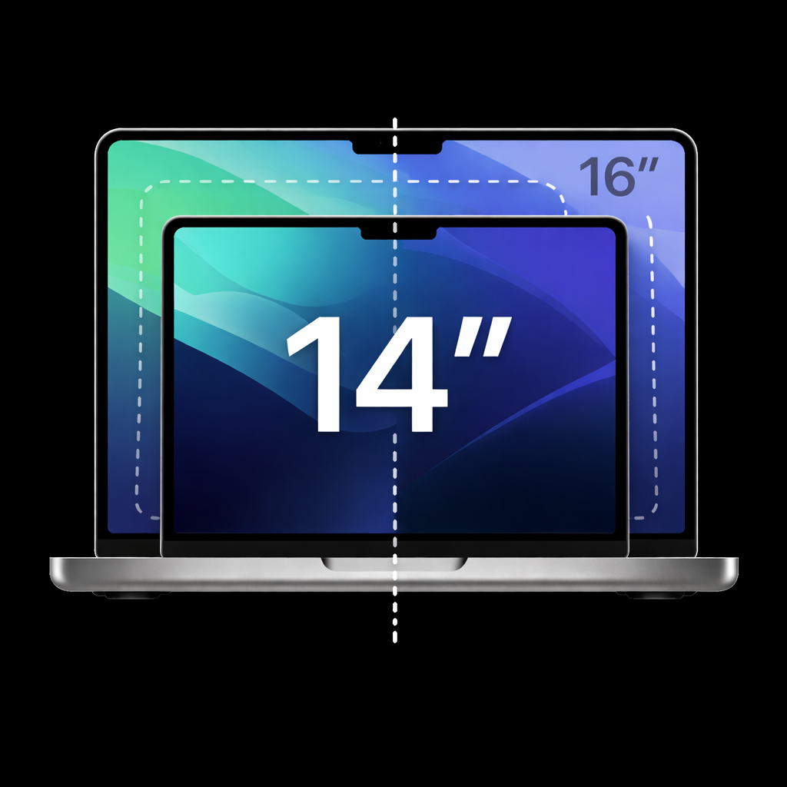
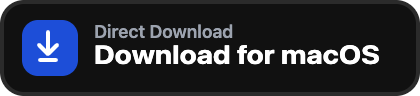
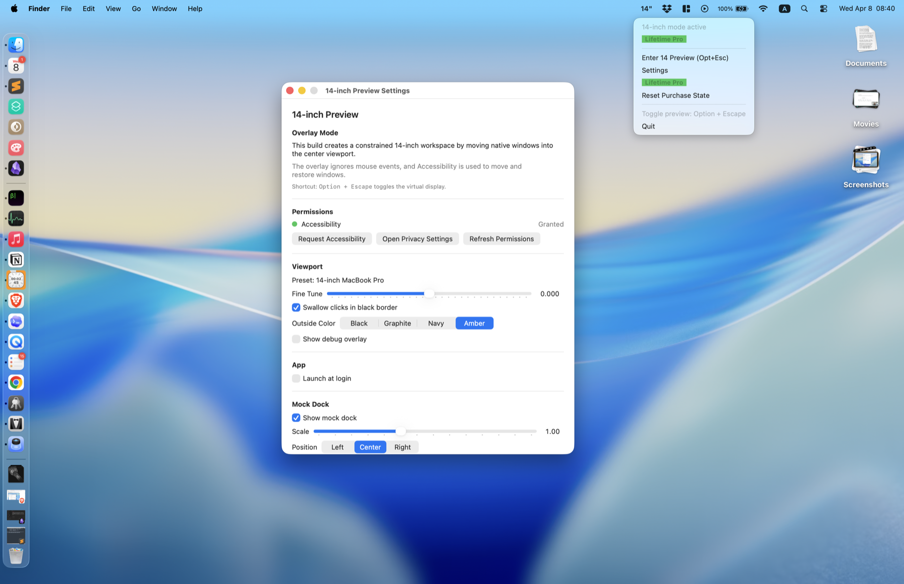
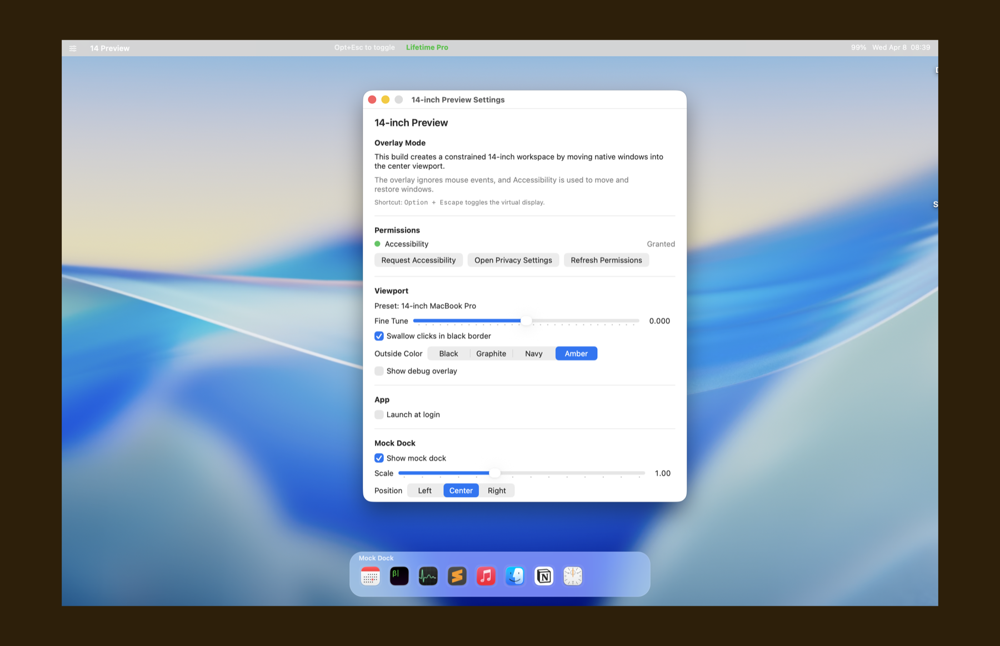

# Preview14

  

  A macOS menu bar app that lets you try a 14-inch workspace on a 16-inch MacBook Pro.

  

  <a href="https://github.com/nextpluginslab/Preview14/releases/latest"><strong>Download Latest Release</strong></a>
  ·
  <a href="https://www.youtube.com/watch?v=X3zQLOrlobA"><strong>Watch Demo</strong></a>
  ·
  <a href="#get-pro"><strong>Get Pro</strong></a>

## Before / After

<table>
  <tr>
    <td align="center"><strong>Before</strong></td>
    <td align="center"><strong>After</strong></td>
  </tr>
  <tr>
    <td></td>
    <td></td>
  </tr>
  <tr>
    <td align="center">Full 16-inch desktop workspace</td>
    <td align="center">Centered 14-inch preview workspace</td>
  </tr>
</table>

## What It Does

Preview14 is a macOS menu bar app built for the internal display of a 16-inch MacBook Pro.

Instead of just covering part of the screen with a fake overlay, it creates a smaller centered workspace that feels much closer to actually using a 14-inch machine. It moves native app windows into that workspace and combines the effect with a virtual menu bar and a mock Dock so you can judge real day-to-day usability.

It is meant for one practical question:

- Is a 14-inch MacBook Pro enough for your workflow?
- Will your usual window layout still feel comfortable?
- Should you switch from a 16-inch model to a 14-inch one?

If you want to test that before buying different hardware, this app is for that.

## Key Features

- Enter or exit 14-inch Mode in one click
- Toggle the preview with `Option + Escape`
- Create a centered 14-inch style workspace on a 16-inch built-in display
- Move and constrain real app windows into that workspace
- Show a virtual menu bar and mock Dock for a more believable preview
- Move the active window, move all windows, or recenter the workspace
- Fine-tune the scale to get the feel you want
- Adjust outside mask color, Dock position, Dock scale, and border click behavior
- Launch at login support
- Free trial usage with a Pro unlock for unlimited switching

## Installation

1. Open the [latest release page](https://github.com/nextpluginslab/Preview14/releases/latest)
2. Download the `.dmg`
3. Open the disk image and drag `14-inch Preview.app` into `Applications`
4. Launch the app from `Applications`, Launchpad, or Spotlight
5. Grant `Accessibility` permission when prompted

## How To Use

1. Launch Preview14 and look for the `14"` icon in the macOS menu bar
2. Grant `Accessibility` permission, otherwise the app cannot move or restore windows
3. Click `Enter 14 Preview` from the menu bar, or press `Option + Escape`
4. The app will move windows into the centered workspace and show the virtual menu bar and Dock
5. If you want to adjust the layout, use:
   - `Move Active Window`
   - `Move All Windows`
   - `Recenter Workspace`
6. Open `Settings` if you want to tweak:
   - `Fine Tune`
   - `Outside Color`
   - `Show mock dock`
   - Dock position and scale
7. Press `Option + Escape` again to leave 14-inch Mode

The fastest evaluation flow is simple:

1. Turn the preview on
2. Move your normal working apps into the simulated workspace
3. Work like that for a while
4. Decide whether a 14-inch Mac still feels right

## Get Pro

Preview14 includes free usage, but not unlimited switching.

- The free version includes the first `9` successful entries into 14-inch Mode
- After that, the app asks you to unlock `Lifetime Pro`
- Once unlocked, the switching limit is removed

The current Pro flow in the app is:

1. Click `Buy Lifetime Pro` in the menu bar or `Unlock Lifetime Pro` in the purchase window
2. Complete checkout on the Stripe payment page
3. After payment, the success page shows your unlock code
4. Return to the app and click `I already paid`
5. Paste the unlock code to unlock Pro

If you only want to evaluate whether a 14-inch machine fits your workflow, the free usage limit is usually enough. If you want to keep comparing 14-inch and 16-inch setups over time, Pro is the better fit.

## Compatibility

- Current builds support the built-in display of a `16-inch MacBook Pro`
- Minimum supported OS is `macOS 15`
- The app currently ships as a direct-download menu bar app, not a Mac App Store app
- `Accessibility` permission is required for cross-app window movement and restoration

If your machine is not using a supported 16-inch MacBook Pro internal display, the app will report that the current build is unsupported.

## Why This Exists

A spec sheet can tell you the display size and resolution. It cannot tell you whether your real workflow will feel cramped.

Preview14 exists to answer that before you spend money on different hardware.

## Development Notes

- Main app source lives in `Sources/FourteenInchPreview/`
- Packaging and release scripts live in `build-tools/`
- README images and download badge live in `assets/readme/`
- Release artifacts are written to `dist/`

If you need signing or release details, start with `build-tools/README.md`.
